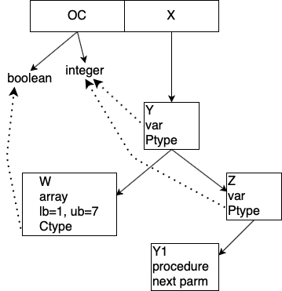
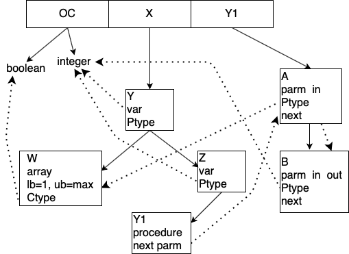

# Data Structures
Below are a brief description of each of the data structures and how they were used in the compiler. 

### bintree.c
A stack of binary trees with ability to search an individual tree or search the entire stack to find a node. Nodes can only be added to the top of the stack however. This is the core data structure for the compiler as all of the variables and data types are stored here. Also have the ability to know how deep in the stack a node was found. This is useful when trying to find if an element is local or non-local based on the location in the stack. 

### linkedList.c
A basic linked list data structure. This is used to move information about data types such as integer, boolean, array or record.

### patchLink.c
A linked list that keeps track of the line numbers and values that need to be used for patching. Whenever there is a jump the values need to patched. In the final code, '**?**' represent values that need to be patched. 

### rec_l.c
A linked list of records that keep track of the variable name, type and the amount of memory space. Makes it easy for information when trying to keep track of the record variable type.  

### record.c
A linked list of records that stories information about variables, such as type, register number, offset and if it is local or non-local.   
***
### Examples
Below are some examples of ada code and the resulting tree


Basic example demonstrating the stack of binary trees and the links between data types.
In the stack, the outer context(OC) are the predefined variable types which in this case are boolean and integer.
Variables Y is added to the tree, then the stack is searched to find the Ptype, in this case integer. The same is done with Z. 
When variable W is added to the tree, the type is defined as an array and a lower and upper bound (lb,ub) are defined as 1 and 7.
Nothing is defined for procedure Y1 now (see next example).
```
procedure X is
	Y, Z : integer;
	type W is array (1..7) of boolean;
	procedure Y1 is  begin  null; end;
begin
   null;
end;
```



***
Similar to the first example with procedure Y1 being filled in and connected to the data types.
Y1 is added to the stack and the first element is added to the binary tree A. The Ptype is searched for and is found as a array belong to procedure X.
Y1 is also linked to where it is defined in procedure X. 
```
procedure X is
	Y, Z : integer;
	type W is array (1..max) of boolean;
	procedure Y1 (A : in W; B : in out integer) is begin  null; end;
begin
   null;
end;
```
